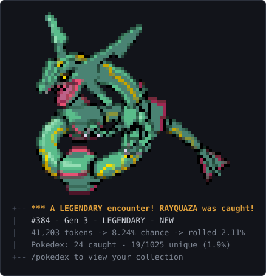
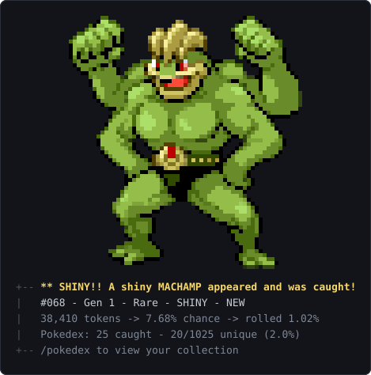
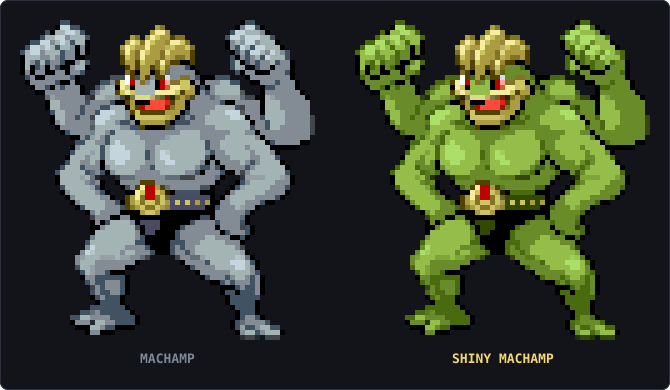
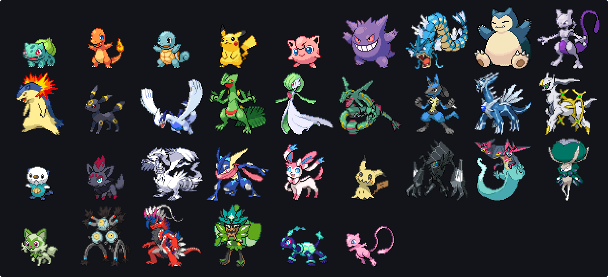
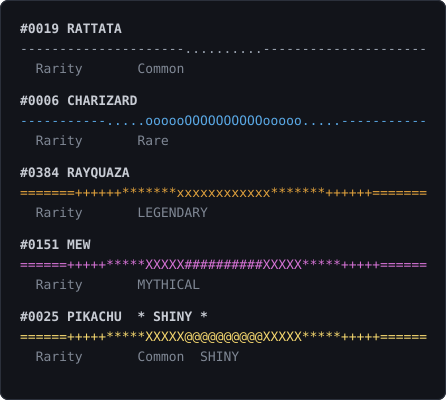

# token-pokemon

Catch Pokémon by working. Every time Claude Code finishes a turn, this plugin rolls
for a wild encounter — and the odds scale with how many tokens that turn burned. A
one-line answer is almost certainly nothing. A long refactor across a dozen files is
a real shot at something good.

Generations 1 through 9. All 1,025 species, every legendary and mythical included.

<p align="center">
  
</p>

The species' art is drawn above that banner. In a truecolour terminal
(`/pokeconfig set spriteMode color`) it looks like the above; the shipped default draws the
same shape in block glyphs that survive any terminal, and `sprites false` drops the art
entirely.

About 1 catch in 128 comes out **shiny** — the alternate colouring, given the headline over
the tier because at those odds it's the rarer half of the event:

<p align="center">
  
</p>

A shiny is a recolour of the same pixels — here the ordinary steel-grey Machamp beside the
shiny green one, identical down to the last pixel but the palette:

<p align="center">
  
</p>

> The images above are SVGs generated from the exact same baked sprite data the plugin
> renders from (`node scripts/build-showcase.js`), so they can't drift from what you'll
> actually catch. In your terminal it's live text, not an image.

There are 1,025 of them waiting, across every generation:

<p align="center">
  
</p>

## Install

```
/plugin marketplace add MohamedAmirMamoon/poketoken
/plugin install token-pokemon@claude-pokemon
```

That's it — no configuration required. Claude Code records the install in your
`settings.json` the same way it does for any plugin: the marketplace under
`extraKnownMarketplaces`, and `"token-pokemon@claude-pokemon": true` under
`enabledPlugins`. Nothing else in that file is touched, and the plugin itself never
writes to it — its own settings live in its own directory (see [Your data](#your-data)).

### Requirements

- **`node` on your `PATH`.** The Stop hook runs `node hooks/pull.js`, so if `node`
  isn't resolvable from your shell the plugin does nothing at all — silently, by
  design, since the hook is forbidden from disrupting a session. Check with
  `node --version`; anything 16 or newer works, and there are no dependencies to
  install.
- **Nothing, for the art.** It defaults to block glyphs and no escape codes, so it
  draws on any terminal. `spriteMode color` is the truecolour version, and it has no
  capability detection — if you turn it on and get escape codes instead of a Pokémon,
  switch back with `/pokeconfig set spriteMode plain`.

Nothing else. No network access at runtime, no API keys, no build step.

### Verifying it works

Catches are rare on purpose, so silence after installing is expected rather than a
symptom. To confirm the plugin is actually wired up, force the parts you can:

```
/pokedex                                    # should print a Pokédex, even when empty
/pokeconfig                                 # should print your current settings
```

If both print, the commands are installed. To check the hook itself, run it directly
from the plugin directory:

```
node hooks/pull.js --dry-run 400000         # a huge fake turn; prints a catch banner, writes nothing
node hooks/pull.js --sprite 25              # print one species' art, to check how it draws
```

`--dry-run` only prints when its roll actually wins, so at normal rates it will usually
print nothing. The 400,000 above buys the maximum 75% chance, so a couple of runs should
land one. Neither flag touches your collection.

If a real turn still never produces anything, set `TOKEN_POKEMON_DEBUG=1` in your
environment. The hook normally swallows every error to guarantee it can't break a
session; that variable makes it print the stack trace instead.

## How the odds work

Each turn, the plugin sums the tokens billed for that turn — `input_tokens` +
`cache_creation_input_tokens` + `output_tokens` across every assistant message since
your last prompt. Cache *reads* are deliberately excluded: they balloon to six figures
in a long conversation and would turn every turn into a guaranteed catch.

That total becomes your catch chance:

```
chance = tokens x 0.000002        (0.0002% per token, i.e. 1% per 5,000 tokens)
chance = min(chance, 0.75)        (a single turn is never a sure thing)
```

| Turn size | Chance |
|---|---|
| 500 tokens (quick question) | 0.1% |
| 5,000 tokens (normal edit) | 1% |
| 40,000 tokens (heavy session) | 8% |
| 375,000+ tokens | 75% (capped) |

Win the roll and a second roll picks the rarity tier, then a species uniformly within it:

| Tier | Species | Odds per catch |
|---|---|---|
| Common | 561 | 78% |
| Rare | 370 | 19% |
| Legendary | 71 | 2.7% |
| Mythical | 23 | 0.3% |

So a mythical is roughly 1 in 333 catches, and catches themselves are uncommon. Arceus
is meant to be a story, not a Tuesday.

Misses are silent by default — no clutter on turns where nothing happens.

### Shinies

One last independent roll decides whether the catch is shiny: 1 in 128 by default, on
any species at any tier. It's deliberately not the games' 1 in 4,096 — at these catch
rates that would be a once-a-decade event, and the point is a surprise you might
actually live to see. A shiny common is rarer than the legendary next to it, which is
why shinies get the headline, a `SHINY` mark, and a permanent slot in your hall of fame
regardless of tier.

Because the roll happens last, it changes nothing about which species you catch.
`/pokeconfig preset shiny-hunt` makes them 8x more common, `no-shinies` turns them off.

A shiny is a recolour, and the default plain art deliberately preserves the silhouette, so
the two look the same there — the `SHINY` mark on the banner is what tells you. Switch to
`spriteMode color` if you want to actually see the alternate palette.

## Commands

| Command | Shows |
|---|---|
| `/pokedex` | Collection summary: totals, completion, rarity and generation breakdowns, hall of fame, recent catches |
| `/pokedex pikachu` | One species: its sprite, generation, rarity, and your catch history (a unique prefix like `pikach` works too). If you've caught it shiny, the shiny art is what you get |
| `/pokedex #25` | The same, addressed by dex id |
| `/pokedex gen3` | Everything caught from one generation (`gen1`–`gen9`, or just `3`) |
| `/pokedex legendary` | One rarity tier (`common`, `rare`, `legendary`, `mythical`; `legendaries` also works) |
| `/pokedex missing` | What you still need, grouped by generation |
| `/pokedex odds` | Your configured rates and lifetime tokens-per-catch (`stats` does the same) |

Every card is headed by a rule that encodes its rarity, so you can read what you're
looking at before you reach the `Rarity` line. Commons and rares are stone; legendaries
and mythicals are sky:

<p align="center">
  
</p>

A shiny takes the loud rule whatever its tier, for the same reason it takes the banner
headline. The `/pokedex` summary wears the rarest thing in your collection, so the header
changes as you climb.

## Tuning

Optional, and easiest through `/pokeconfig` — it validates what you give it, writes only
the keys you actually changed, and leaves anything else in the file alone.

| Command | Does |
|---|---|
| `/pokeconfig` | Current settings, with what each one means |
| `/pokeconfig rate 1% per 2000 tokens` | Set the rate in human terms (`1%/2000` works too) |
| `/pokeconfig set maxChance 60%` | Set one key; percentages accepted where they make sense |
| `/pokeconfig gens 1-3,7-9` | Limit the catch pool. `all` to lift it, `-6` or `exclude 6` to drop one gen |
| `/pokeconfig preset kanto` | Apply a bundle: `default`, `hardcore`, `casual`, `kanto`, `classic`, `modern`, `no-legendaries`, `shiny-hunt`, `no-shinies` |
| `/pokeconfig simulate 8000 20000` | Monte-Carlo your settings over N turns before committing |
| `/pokeconfig reset [key]` | Forget one key, or the whole file |
| `/pokeconfig path` | Where the collection and config live |

Or write `~/.claude/token-pokemon/config.json` yourself:

```json
{
  "ratePerToken": 0.000002,
  "maxChance": 0.75,
  "tierWeights": { "common": 78, "rare": 19, "legendary": 2.7, "mythical": 0.3 },
  "gens": [1, 2, 3],
  "showMisses": false,
  "sprites": true,
  "spriteWidth": 48,
  "spriteMode": "plain",
  "shinyChance": 0.0078125,
  "enabled": true
}
```

| Field | Meaning |
|---|---|
| `ratePerToken` | Catch chance per token. Raise for a faster game — `0.00001` is 1% per 1,000 tokens. |
| `maxChance` | Ceiling on any single turn's chance, 0–1. |
| `tierWeights` | Relative tier weights. Set `legendary` and `mythical` to 0 for a legendary-free run. |
| `gens` | Generations the pool draws from. Omit for all nine. |
| `showMisses` | `true` prints a one-line report on every turn, including misses. |
| `sprites` | `false` prints the banner without the pixel art. |
| `spriteWidth` | Terminal columns the sprite is downsampled to, 8–64. `plain` art caps at 32, above which it already holds every source pixel. |
| `spriteMode` | `plain` (default) draws block glyphs with no escape codes, so the art survives being captured out of a slash command as text; each cell resolves four subcells, which puts the silhouette's edges on half-cell boundaries. `color` draws truecolour half-blocks — sharper in a terminal that renders them, unreadable anywhere the escapes are stripped. |
| `shinyChance` | Chance a catch is shiny, 0–1. `0` turns shinies off; the default `0.0078125` is 1 in 128. |
| `enabled` | `false` pauses pulling without uninstalling. |

Any missing or malformed field silently falls back to its default, and an unusable value
widens rather than narrows — `"gens": [1, 2, 300]` gives you Gens 1–2, not an empty pool.
Changes apply on the next turn, no restart.

## Your data

Two files, both under `~/.claude/token-pokemon/` — or under `$CLAUDE_CONFIG_DIR` instead,
if you've set one, which is also how you'd keep separate collections per machine or
project. `/pokeconfig path` prints the resolved locations.

| File | What it is |
|---|---|
| `collection.json` | Every catch, plus lifetime turn and token totals |
| `config.json` | Only the settings you changed. Absent until you change one |

Both are plain JSON — back them up, sync them, or hand-edit them freely. The collection
is read defensively: every row is normalized, so a partial hand-written entry gets
sensible defaults and an unrecognizable one is dropped rather than breaking `/pokedex`.
A `config.json` that doesn't parse gets copied to `config.json.bak` and reported rather
than silently discarded.

To start over, delete `collection.json`. To pause without losing anything,
`/pokeconfig set enabled false`. Uninstalling the plugin leaves both files where they
are, so reinstalling picks your collection back up.

## Troubleshooting

| Symptom | Likely cause |
|---|---|
| Nothing ever happens | Usually just the odds — a 5,000-token turn is a 1% shot. Confirm the wiring with `node hooks/pull.js --dry-run 400000`, then check `node --version` resolves, then `TOKEN_POKEMON_DEBUG=1` for the real error |
| Escape codes instead of art | You're in `spriteMode color` and your terminal isn't truecolor. `/pokeconfig set spriteMode plain` |
| Art looks blocky or coarse | `/pokeconfig set spriteWidth 32` — plain art holds every source pixel at 32 columns and shrinks below that |
| Art is too wide, or wraps | `/pokeconfig set spriteWidth 32` |
| `/pokedex` and `/pokeconfig` unknown | The plugin isn't installed or is disabled. Re-check with `/plugin` |
| Catches feel too rare, or too common | `/pokeconfig simulate 8000 20000` projects your settings over 20,000 turns before you commit to them; `preset casual` and `preset hardcore` are the ready-made ends |
| A catch was missed on a turn you know was expensive | Cache *reads* don't count toward the roll, only fresh input, cache writes, and output. `/pokedex odds` shows your real lifetime tokens-per-catch |

Every failure path in the hook is silent by design — it exits 0 no matter what, because a
gacha toy is not allowed to interrupt real work. `TOKEN_POKEMON_DEBUG=1` is the one way to
make it talk.

## Design notes

**It cannot break your session.** The hook wraps everything in try/catch and always
exits 0. Malformed stdin, a missing transcript, a corrupt collection file — all exit
silently. Set `TOKEN_POKEMON_DEBUG=1` to see the stack trace when something goes wrong.

**No network, no dependencies.** The full Pokédex ships as `data/dex.json` and the sprite
art as `data/sprites/`, both generated once from [PokeAPI](https://pokeapi.co). Runtime is
Node stdlib only, targeting Node 16+. A turn costs a few hundred milliseconds of hook
time, most of it Node startup.

**The art defaults to escape-free, without defaulting to coarse.** Slash command output
reaches the model as a plain string with the ESC bytes stripped, so truecolour art arrives
as literal `[38;2;...m` noise and `/pokedex` cannot relay it. Plain mode spends no escapes:
the silhouette rides on the space/non-space boundary and the shading ramp `█▓▒░` carries
depth. The obvious cost would be resolution — one glyph per cell can only say "this whole
cell is filled, at roughly this brightness", so every edge rounds to a whole character. So
each cell is instead sampled as a 2x2 grid and drawn with the quadrant glyph matching which
subcells are opaque (`▘▝▀▖▌▞▛▗▚▐▜▄▙▟`), which puts edges on half-cell boundaries and
quadruples the effective pixel count at the same column footprint. Fully-covered cells still
draw from the ramp, so interiors keep their shading; partial cells spend their glyph on the
edge, because a misplaced edge is a misidentified Pokémon.

**The header rule carries the rarity.** A flat row of `=` was the same line on a Rattata as
on Arceus, spending a full row of a small report on nothing. It now draws from a per-tier
glyph ramp as a burst that is brightest in the middle, so rarity shows up twice over: in the
vocabulary (stone for commons and rares, stars for legendaries and mythicals) and in how far
the bright band reaches. It stays plain ASCII and exactly 52 columns, because the rule shares
captured stdout with the sprite art and a header that degraded to mojibake would cost more
than the decoration is worth.

**Shinies cost almost nothing to ship.** A shiny is a pure recolour for 986 of the 1,025
species, so `data/sprites/shiny/` stores a replacement palette and reuses the normal
pixels verbatim — 396 bytes each instead of a duplicate sprite, about 11x smaller than
baking the art twice. The remaining 39 crop to slightly different geometry, because their
antialiasing crosses the transparency cutoff differently, and ship a standalone payload
instead. Either way, a missing or unreadable shiny file falls back to the ordinary colours
rather than losing the art: the catch matters, the palette doesn't.

**Concurrency-safe.** Multiple Claude Code sessions finishing at once won't clobber each
other. Writes go through an advisory lockfile, then an atomic rename. A lock is only
ever reclaimed when it is provably abandoned — the holding process is gone, or the file
has aged out — and if the lock can't be taken within the wait budget the turn is skipped
rather than written unlocked, because an unlocked read-modify-write is exactly the
lost-update race the lock exists to prevent. Verified with 20 simultaneous writers
against collections up to 10,000 entries: no lost writes, no corruption.

**Bounded.** `stats` holds the lifetime totals, so per-catch history is capped at 20,000
rows — every write rewrites the file under the lock, and an unbounded collection would
make that critical section grow without limit. Your turn and token totals stay exact
regardless.

**Streaming-aware.** Claude Code writes one transcript record per content block, each
repeating the same cumulative usage for that message. Naively summing them inflates
token counts about 3x, so records are deduped by message ID. Subagent (sidechain)
messages are excluded — they bill separately and would otherwise be misattributed.

**Interrupt-aware.** A turn is the span since your last prompt, and interrupts are written
into the transcript as user-role text (`[Request interrupted by user]`), so they look
exactly like one. Treating them as prompts orphaned every token spent before the interrupt
— measured at 4.5% of billable tokens across a real transcript corpus. They're recognized
and skipped, so pressing escape mid-answer still counts toward your roll.

## Development

Everything runs from `plugins/token-pokemon/`:

```
npm test                                 # 304 tests across 8 suites
node tests/roll.test.js                  # one suite, incl. 100k-trial distribution checks
node hooks/pull.js --dry-run 40000       # simulate a 40k-token turn
node hooks/pull.js --sprite 25           # preview one sprite
npm run build:dex                        # regenerate data/dex.json from PokeAPI
npm run build:sprites                    # regenerate data/sprites/ from PokeAPI artwork
npm run build:shiny                      # regenerate data/sprites/shiny/ (needs sprites first)
npm run build:showcase                   # regenerate docs/showcase/*.svg (README art)
node scripts/build-showcase.js --check   # fail if any showcase SVG is out of date
```

There are no dev dependencies, so `npm` is a convenience rather than a requirement —
every script above is just `node <path>`, and `node tests/run-all.js` is the whole suite.

No test framework either: `tests/run-all.js` runs each suite in its own
process and each suite is a plain Node script you can run directly. Only the first three
build scripts touch the network, and only to regenerate the shipped data files.
`build:shiny` derives its palettes against the already-baked normal sprites, so run it
after `build:sprites`; both are deterministic and safe to re-run. `build:showcase` reads no
network at all — it draws the README's SVGs straight from the baked payloads, so `--check`
catches a diff that forgot to regenerate them.

The tests write only to `os.tmpdir()`, via `CLAUDE_CONFIG_DIR` — running the suite never
reads or touches your real collection.

### Layout

Two levels: the repo is a marketplace, which contains one plugin.

```
.claude-plugin/marketplace.json      the marketplace, listing the plugin below
plugins/token-pokemon/
  .claude-plugin/plugin.json         plugin manifest
  hooks/hooks.json                   registers the Stop hook
  hooks/pull.js                      the hook: read stdin, sum tokens, roll, persist, print
  commands/                          /pokedex and /pokeconfig, thin wrappers over scripts/
  scripts/                           what those two commands actually run, plus the builds
  lib/                               config, store, roll, render, sprite, transcript, gens
  data/                              dex.json, sprites/, sprites/shiny/
  tests/                             one suite per concern; run-all.js runs them all
docs/showcase/                       generated SVGs the README embeds
```

## License

MIT
